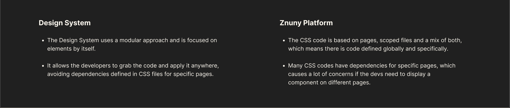
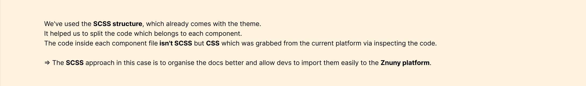
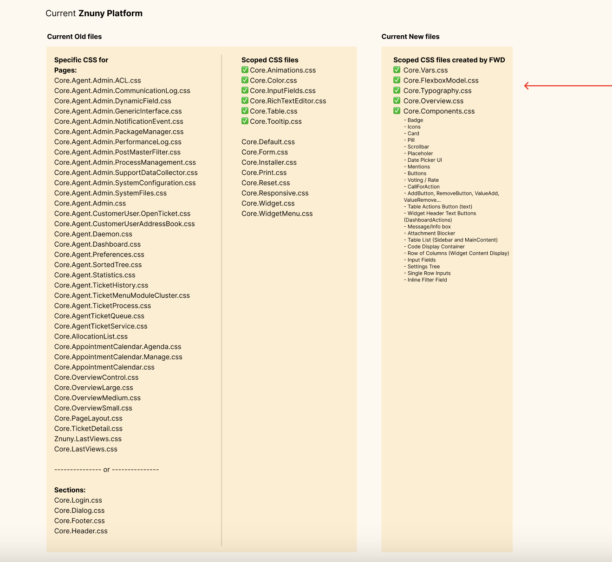
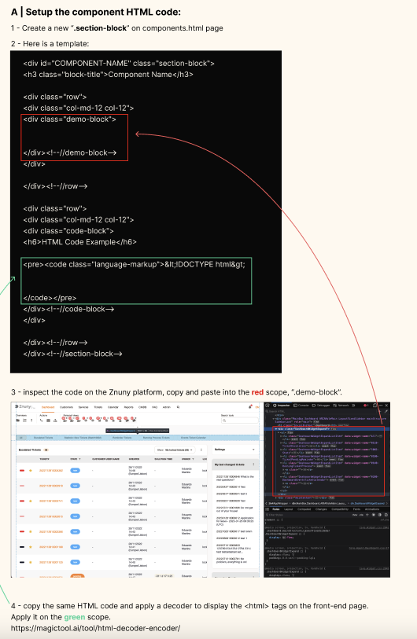
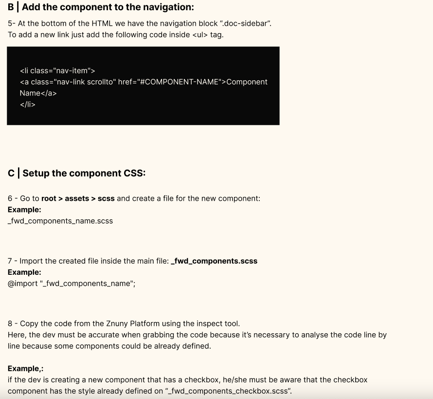

# Todo

- [x] Core.Color.css
- [ ] Core.Components.css
- [ ] Core.Structures.css missing in Framework (Core.PageLayout)?
- [x] Core.Vars.css

# Design-System

## Overview

### Difference

**Difference between Design System and Znuny Framework**

| Design System | Znuny Framework |
|-|-|
| The Design System uses a modular approach and is focused on elements by itself.| The CSS code is based on pages, scoped files and a mix of both, which means there is code defined globally and specifically |
| It allows the developers to grab the code and apply it anywhere, avoiding dependencies defined in CSS files for specific pages. | Many CSS codes have dependencies for specific pages, which causes a lot of concerns if the dev need to display a component on different pages.|





### Structure

`assets/scss/Design-System` - contains all styles for the design system itself.

`assets/scss/Znuny` - only these files are edited to change the framework design.

## Getting started

[Check out on Forwwward Figma](https://www.figma.com/file/vAPnUwnoM7hh7s0jMxkTXV/Znuny-(Client)?type=design&node-id=5906-4110&mode=design)

## Contribute

### SASS

https://sass-lang.com/install/

#### Installation

##### Install Anywhere (npm)

```
npm install -g sass
```

##### Install on Windows (Chocolatey)

```
choco install sass
```

##### Install on Mac OS X or Linux (Homebrew)

```
brew install sass/sass/sass
```

#### Usage

```
sass assets/scss/Znuny/_Core.Color.scss         css/Znuny/Core.Color.css      --style=expanded
sass assets/scss/Znuny/_Core.Components.scss    css/Znuny/Core.Components.css --style=expanded
sass assets/scss/Znuny/_Core.Structures.scss    css/Znuny/Core.Structures.css --style=expanded
sass assets/scss/Znuny/_Core.Vars.scss          css/Znuny/Core.Vars.css       --style=expanded
```

### VSCode

#### Installation

[Live Server](https://marketplace.visualstudio.com/items?itemName=ritwickdey.LiveServer)

[Live Sass Compiler](https://marketplace.visualstudio.com/items?itemName=glenn2223.live-sass)

Settings on VSCode:

```
  "liveSassCompile.settings.formats": [
    {
      //"format": "expanded",
      //"extensionName": ".css",
      "format": "compressed",
      "extensionName": ".min.css",
      "savePath": "/css",
      "savePathReplacementPairs": null
    }
  ],
```


### Add / Update CSS Style

`assets/scss/Znuny` - only these files are edited to change the framework design.

### Add new components

`assets/scss/Znuny/Components` - new components should be added here.

And also import into `assets/scss/Znuny/_Core.Components.scss`



[html-decoder-encoder](https://magictool.ai/tool/html-decoder-encoder/)



