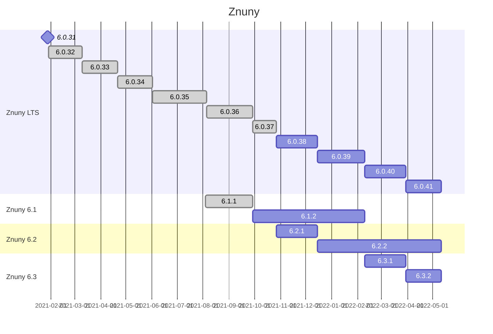
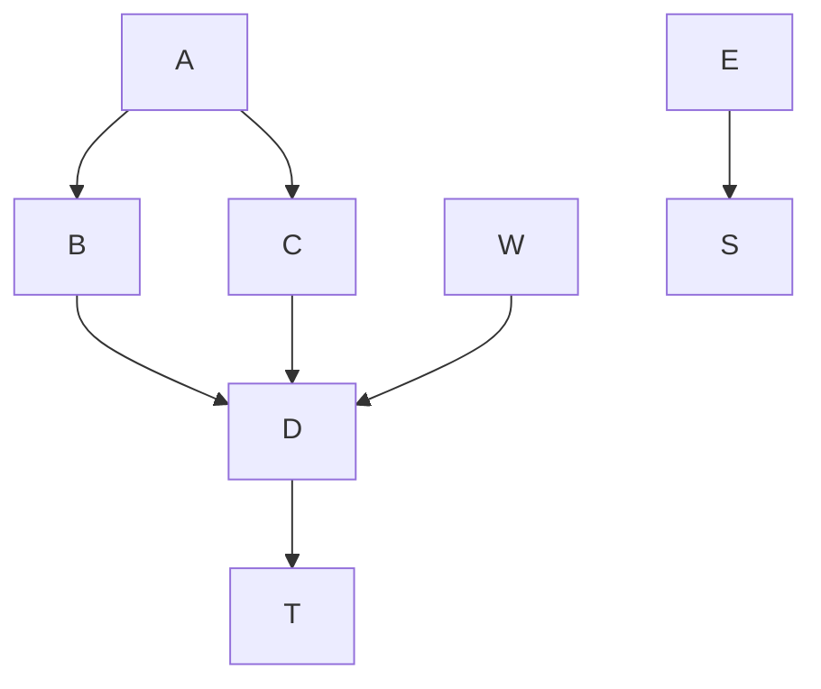
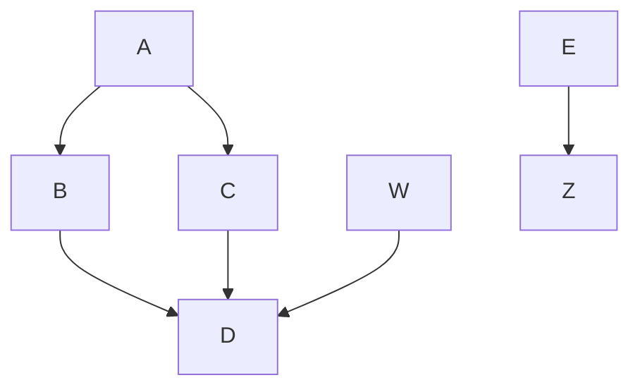

# Playground Repo

<!-- generated by mermaid compile action - START -->

  
Mermaid markup

<!-- generated by mermaid compile action - END -->

# Test this out

Here is an inline mermaid file

<!-- generated by mermaid compile action - START -->

  
Mermaid markup

<!-- generated by mermaid compile action - END -->

<!-- generated by mermaid compile action - START -->

  
Mermaid markup

<!-- generated by mermaid compile action - END -->
